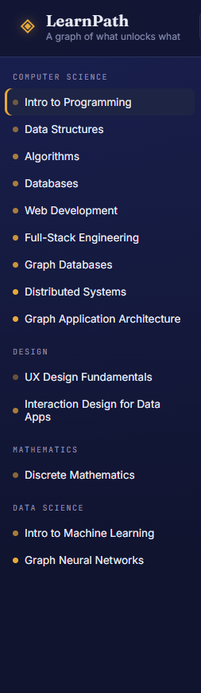
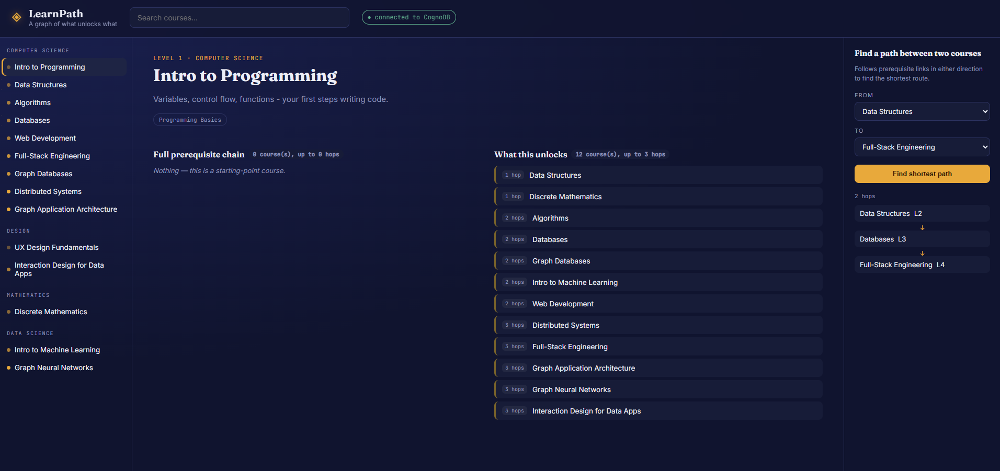

# LearnPath — Course Prerequisite & Learning Path Explorer

A small web app that lets anyone explore a curriculum as a graph: which
courses unlock which, the full (multi-hop) prerequisite chain for any
course, and the shortest learning path between two courses. Built on
**CognoDB** (openCypher over Bolt) via the official `neo4j-driver` package.

## 1. The use case

Curricula, certifications, and internal L&D programs are naturally graphs:
courses depend on other courses, courses teach skills, and skills open up
further skills. Learners and advisors constantly ask graph-shaped
questions:

- "What do I actually need to finish before I can take *Distributed
  Systems* — not just the direct prerequisite, but everything behind it?"
- "I just finished *Data Structures* — what does that open up, directly
  and indirectly?"
- "What's the shortest route from *Intro to Programming* to *Graph Neural
  Networks*?"

LearnPath answers exactly these questions, live, against a real graph
database.

## 2. Why a graph database?

A prerequisite chain is a **variable-length, unbounded-depth path**
problem. In Cypher this is one line:

```cypher
MATCH path = (c:Course {id: $id})-[:REQUIRES*1..6]->(p:Course)
```

In a relational schema the same question needs a **recursive CTE**, careful
cycle detection, and gets slower and more awkward the deeper the chain
goes. Shortest-path between two arbitrary courses is worse still — SQL has
no native shortest-path operator, so you'd hand-roll a BFS in application
code with multiple round-trips to the database. Cypher gives it to us in
one `shortestPath()` call.

The domain is also **relationship-heavy, not attribute-heavy**: courses
have few columns but many meaningful connections (prerequisites, taught
skills, categories, skill-to-skill dependencies). Modelling that in tables
means a proliferation of join tables and multi-way joins for even simple
questions; modelling it as a graph means the schema *is* the mental model
— a course node with typed edges to the things it relates to. As the
curriculum grows, query cost for "how are these two courses related" stays
proportional to the size of the path, not the size of the whole dataset,
which is not true of a relational join across the equivalent tables.

## 3. Data model

```
(:Category {name})
       ▲
       │ BELONGS_TO
       │
(:Course {id, title, level, description}) ──REQUIRES──▶ (:Course)
       │
       │ TEACHES
       ▼
(:Skill {name}) ──ENABLES──▶ (:Skill)
```

- **Course** — a unit of learning. Properties: `id`, `title`, `level`,
  `description`.
- **Category** — grouping such as "Computer Science" or "Design".
- **Skill** — a competency a course teaches.
- **`REQUIRES`** — `(Course)-[:REQUIRES]->(Course)`: the source course
  requires the target as a prerequisite. Chains of these edges form the
  multi-hop prerequisite graph.
- **`TEACHES`** — `(Course)-[:TEACHES]->(Skill)`.
- **`ENABLES`** — `(Skill)-[:ENABLES]->(Skill)`: acquiring one skill sets a
  learner up for another, independent of any single course.
- **`BELONGS_TO`** — `(Course)-[:BELONGS_TO]->(Category)`.

Seed data: 14 courses across 4 categories, ~15 `REQUIRES` edges (including
a diamond-shaped dependency and a 4-hop-deep chain), 14 skills, 9 `ENABLES`
edges. See `scripts/seed.js` for the full dataset.

## 4. Project structure

```
.
├── server.js            # Express app + API routes
├── db.js                # CognoDB (Bolt) driver, connection handling
├── queries.js            # All Cypher, fully parameterised
├── scripts/
│   └── seed.js           # Loads sample data into CognoDB
├── public/                # Static frontend (vanilla HTML/CSS/JS)
│   ├── index.html
│   ├── style.css
│   └── app.js
├── .env.example
└── package.json
```

## 5. Setup

### 5.1 Create a CognoDB instance

1. Go to [console.cognodb.com/signup](https://console.cognodb.com/signup)
   and create a free account (no credit card required).
2. Create a free **c0** instance and pick a region — it provisions in
   under a minute.
3. Copy the connection URI (`bolt+s://<instance-id>.databases.cognodb.cloud`)
   and the generated password for user `cognodb`. **The password is shown
   once** — save it immediately.

### 5.2 Configure the app

```bash
git clone <this-repo-url>
cd learnpath-graph
cp .env.example .env
```

Edit `.env`:

```
COGNODB_URI=bolt+s://<instance-id>.databases.cognodb.cloud
COGNODB_USER=cognodb
COGNODB_PASSWORD=<your-generated-password>
PORT=3000
```

### 5.3 Install, seed, run

```bash
npm install
npm run seed     # loads the sample curriculum into CognoDB
npm start         # starts the app on http://localhost:3000
```

Open `http://localhost:3000`. The connection indicator in the top bar
shows live whether the app can reach CognoDB.

## 6. Main queries, explained

All queries live in `queries.js` and are run with parameters — never
string-concatenated Cypher.

| Query | What it does | Why it's graph-shaped |
|---|---|---|
| `FULL_PREREQUISITE_CHAIN` | `MATCH (c)-[:REQUIRES*1..6]->(p)` — every course transitively required, with the shortest depth at which each is reached | Variable-length path, 1–6 hops in one query |
| `FULL_UNLOCK_CHAIN` | Same pattern, reversed — everything that becomes available once a course is done | Same |
| `SHORTEST_PATH` | `shortestPath((a)-[:REQUIRES*..8]-(b))` between any two courses, either direction | No relational equivalent without app-side BFS |
| `SKILL_EXPANSION` | Courses teaching a skill, plus the further skills those courses' skills `ENABLE` | Chains two different relationship types across a variable path |
| `SEARCH_COURSES` | Case-insensitive substring match on title/description | Simple, but still parameterised, no string concatenation |

## 7. API

| Method | Route | Description |
|---|---|---|
| GET | `/api/health` | Live DB connectivity check |
| GET | `/api/courses` | All courses, grouped by category |
| GET | `/api/courses/:id` | Course detail + full prerequisite/unlock chains |
| GET | `/api/path?from=&to=` | Shortest path between two courses |
| GET | `/api/skills/:name/courses` | Courses teaching a skill + skills it opens up |
| GET | `/api/search?q=` | Search by title/description |

## 8. Error handling

If CognoDB is unreachable, the server still starts (see `db.js` /
`server.js`): every route returns a `503` with a readable message instead
of throwing, and the UI's connection badge turns red and each panel shows
an explicit error state rather than hanging or crashing.

## 9. Deployment

Any Node host works (Render, Railway, Fly.io, etc.) — it's a single
Express process serving both the API and the static frontend. Set the same
three `COGNODB_*` environment variables (plus `PORT` if required by the
host) in the platform's dashboard; nothing else changes.

**Demo link:** https://learnpath-graph-database-app-assignment.onrender.com
**Screen recording:** https://drive.google.com/file/d/1FB48aDWiV-tUy3fyJ5o2abfFuuFGOur8/view?usp=sharing

## 10. Screenshots

**Course list**


**Course detail — prerequisite chain**


**Path finder**


